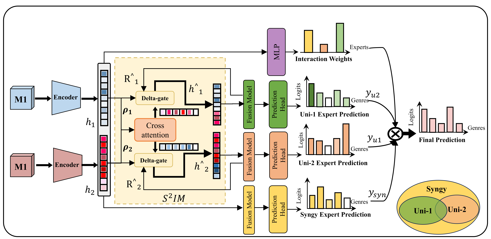

# ISI-MoE: Importance-Aware Sparse Interaction Mixture-of-Experts

## Overview

Multimodal fusion integrates heterogeneous modalities to improve prediction and reasoning beyond unimodal representations. However, multimodal collaboration is inherently asymmetric: different modalities contribute unequally across samples and require different interaction directions and strengths. Existing fusion methods often rely on dense or weakly controlled cross-modal interactions, which can introduce redundant information exchange and obscure modality-specific and synergistic information roles. To address this issue, we propose Importance-Aware Sparse Interaction Mixture-of-Experts (ISI-MoE), an interpretable framework for asymmetric multimodal collaboration. ISI-MoE estimates sample-level modality importance using the Mutual Information Rate (MIR) and introduces AMSS to dynamically calibrate modality-strength contributions across different training stages. The calibrated importance signal guides sparse incremental cross-attention for controllable token-level cross-modal exchange. Grounded in Partial Information Decomposition (PID), ISI-MoE further introduces S2IM to constrain expert discrepancies and enforce bidirectional alignment, encouraging experts to specialize in modality-specific and cross-modal synergistic information. Extensive experiments on four real-world multimodal datasets show that ISI-MoE achieves the best performance among compared methods while maintaining computational efficiency.



## Environment setup

```shell
conda create -n isimoe python=3.10 -y
conda activate isimoe
pip install -r requirements.txt
```

The core Transformer path can run without sparse fusion. FasterMoE is required only when `--fusion_sparse True`; follow its CUDA-specific installation notes for that configuration.

## Data directory

Create a `data` directory under the repository root. Raw datasets are not redistributed because their original licenses and, for clinical datasets, data-use agreements continue to apply.

```text
data/
├── adni/
│   ├── label.csv
│   ├── PTID_splits.json
│   ├── image/
│   ├── genomic/
│   ├── clinical/
│   └── biospecimen/
├── cmu-mosi/
│   └── mosi_data.pkl
├── mm-imdb/
│   └── multimodal_imdb.hdf5
└── enrico/
    ├── design_topics.csv
    ├── screenshots/
    └── wireframes/
```

## Train Models

### Train ISI-MoE models

- Supported fusion methods: `<fusion>` in `transformer`, `interpretcc`, `moepp`, `switchgate`.
- Supported datasets: `<dataset>` in `adni`, `mmimdb`, `mosi`, `mosi_regression`, `enrico`.

```shell
source scripts/train_scripts/isimoe/<fusion>/run_<dataset>.sh
```

## License

The code is released under the [MIT License](LICENSE).
